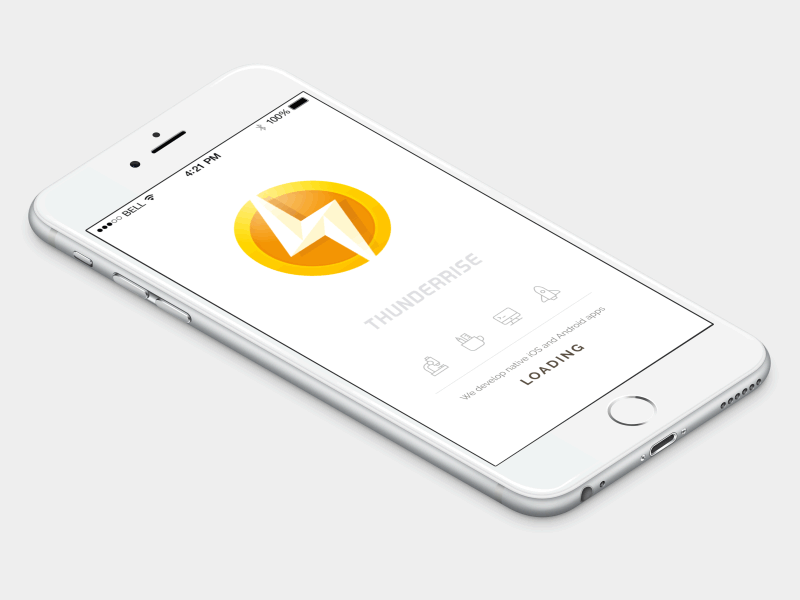
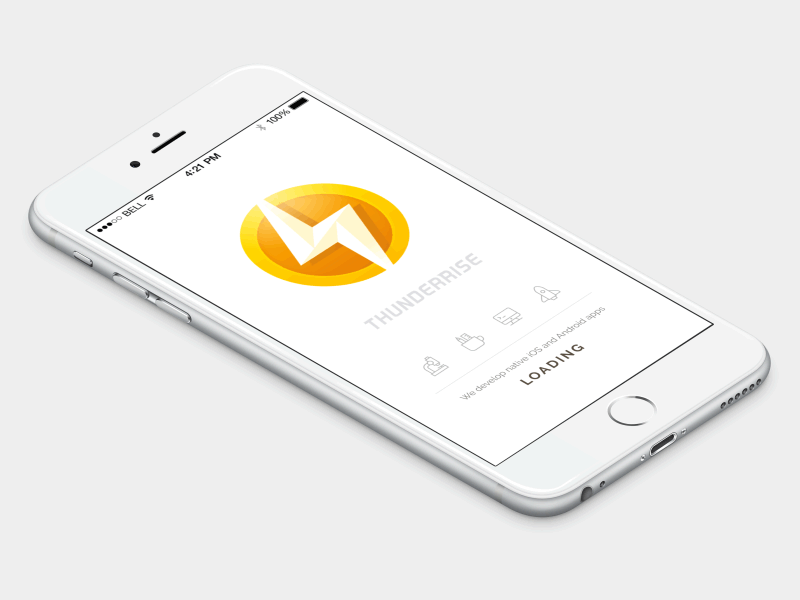

# android-animations


[](https://jitpack.io/#thunderrise/android-animations)
[](https://github.com/thunderrise/UIView-TNRAnimationHelper/blob/master/LICENSE)

##Android animations
[](http://thunderrise.com/)

This is a library that contains practical animations: Rotation, Flip, Horizontal and Vertical Shake, Pulse.

Designed simply and elegant these components are easy to integrate during development process. 

###To get a Git project into your build:

####Step 1. Add the JitPack repository to your build file
Add it in your root build.gradle at the end of repositories:

```
allprojects {
		repositories {
			maven { url "https://jitpack.io" }
		}
	}
```
  
####Step 2. Add the dependency

	dependencies {
	        compile 'com.github.thunderrise:android-animations:-SNAPSHOT'
	}

 
 - **Rotation**



####Init animation Rotate

    RotateAnimation.create().with(rotationImage)
                .setRepeatCount(RotateAnimation.INFINITE)
                .setRepeatMode(RotateAnimation.RESTART)
                .setDuration(2000)
                .start();

 - **Flip**


####Init animation Flip
		
    FlipAnimation.create().with(flipImage)
                .setDuration(3600)
                .setRepeatCount(FlipAnimation.INFINITE)
                .start();

 - **Shake**


####Init animation Shake 

	ShakeAnimation.create().with(shakeImage)
                .setDuration(2000)
                .setRepeatMode(ShakeAnimation.RESTART)
                .setRepeatCount(ShakeAnimation.INFINITE)
                .start();

 - **Pulse**



####Init animation Pulse

    PulseAnimation.create().with(pulseImage)
                .setDuration(310)
                .setRepeatCount(PulseAnimation.INFINITE)
                .setRepeatMode(PulseAnimation.REVERSE)
                .start();
						
## License

	The MIT License (MIT)

	Copyright © 2016 Thunderrise

	Permission is hereby granted, free of charge, to any person obtaining a copy
	of this software and associated documentation files (the "Software"), to deal
	in the Software without restriction, including without limitation the rights
	to use, copy, modify, merge, publish, distribute, sublicense, and/or sell
	copies of the Software, and to permit persons to whom the Software is
	furnished to do so, subject to the following conditions:

	The above copyright notice and this permission notice shall be included in
	all copies or substantial portions of the Software.

	THE SOFTWARE IS PROVIDED "AS IS", WITHOUT WARRANTY OF ANY KIND, EXPRESS OR
	IMPLIED, INCLUDING BUT NOT LIMITED TO THE WARRANTIES OF MERCHANTABILITY,
	FITNESS FOR A PARTICULAR PURPOSE AND NONINFRINGEMENT. IN NO EVENT SHALL THE
	AUTHORS OR COPYRIGHT HOLDERS BE LIABLE FOR ANY CLAIM, DAMAGES OR OTHER
	LIABILITY, WHETHER IN AN ACTION OF CONTRACT, TORT OR OTHERWISE, ARISING FROM,
	OUT OF OR IN CONNECTION WITH THE SOFTWARE OR THE USE OR OTHER DEALINGS IN
	THE SOFTWARE.
